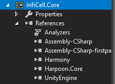

# InfiCell
InfiCell is a reflective mono DLL injector for Dungeon of the Endless that doesn't modify any of the source files or includes them. It uses a minified version of [Harpoon](https://github.com/nielsbishere/harpoon) and uses it to attach to or launch a new game.  
  
InfiCell could in the future allow you to modify common features, like modules, rooms, NPCs, monsters and so on. This doesn't require any knowledge about how DotE's source code is structured. However, features that aren't supported by InfiCell can still be accessed through C# reflection.  
  
InfiCell's Listeners allow you to listen to events happening in the dungeon; currently it can only know if you finish a dungeon, enter a dungeon and leave a dungeon. But it could also listen to things such as rooms opening, crystal being carried, monsters spawning, rooms spawning, etc. This can prove very useful when you want to add custom game modes, custom events and so on. However, do note that you should implement networking correctly when doing so. [Harmony](https://github.com/pardeike/Harmony) is primarily used for the listeners.

## How to use the launcher
You can pull the repo and make sure Visual Studio 15 2017 is installed. Along with VS, you require DotE to be installed through steam (or it has to be opened already).  
  
To set up the project, you have to set up the references. UnityEngine.dll, Assembly-CSharp.dll and Assembly-CSharp-firstpass.dll are located at `%STEAM%/steamapps/common/Dungeon of the Endless/DungeonoftheEndless_Data/Managed`, where `%STEAM%` is your steam directory. Only then can the project build.  
DotE runs 32-bit, so I recommend setting your configuration to Release x86 (Debug doesn't do a lot for us).  
If we build it, it should give us the 'InfiCell.exe' file under the Release folder. If you run this, it will insert the mods from the mods folder into the running application (or it will start the application through steam).  
You can check if the launcher worked correctly by going to your steam directory and finding the "output_log.txt" file. It should tell you that it found Harpoon.Core.dll and that it is now scanning the mods folder.  
The 'mods' folder is located next to the executable and all mod assemblies are injected when you run the launcher; allowing them to modify the game.

## How to add a mod
The following is an example of a mod:
```cs
using Harpoon.Core;
using System;
using System.Reflection;

namespace MyNamespace
{
    class MyMod : InfiCellMod, IDungeonListener
    {
        
        public override ModMetadata Metadata =>
            new ModMetadata
            {
                AuthorName = "Nielsbishere",
                ModDescription = "This is my mod",
                ModName = "MyMod",
                ModVersion = "0.0.1"
            };
        
        public override void Initialize()
        {
            //Initialize everything
        }
        
        public void OnEnter(Dungeon dungeon)
        {
            Console.WriteLine("Hey dungeon");
            dungeon.AddDust(40);
        }

        public void OnLeave(Dungeon dungeon)
        {
            Console.WriteLine("Bye dungeon");
        }

        public void OnWin(Dungeon dungeon, bool isLastLevel)
        {
            Console.WriteLine($"Finished floor; lastFloor = {isLastLevel}");
        }

    }
}
```
This test mod adds 40 dust everytime you enter a dungeon; it also logs if you leave/enter or win a dungeon.  
Right now those are the current abilities of InfiCell; but the listener system is expandible, so pull requests are appreciated.  
This mod requires references to DotE as well as InfiCell.Core. When you build it, you can put it into the mods directory.  

## Contribution
Contributing to this project can be done by expanding it through pull requests. I will check for consistency with the source code and if it runs. If you want to learn how to mod, you can check the [documentation](https://github.com/Nielsbishere/InfiCell/blob/master/docs/main.md). If you know how to use Harmony, you can look at our [mod class](https://github.com/Nielsbishere/InfiCell/blob/master/InfiCell.Core/Core/InfiCellMod.cs) that handles hooks and interfaces. Inspecting the original DotE code can be done by loading the dll (stored in the steam folder) into dnSpy. I'd suggest entrypoints such as Dungeon, Hero, Room and Module.

## APIs used
[Harpoon](https://github.com/nielsbishere/harpoon) for reflective DLL mono injection.  
[Harmony](https://github.com/pardeike/Harmony) for C# bytecode injection.
